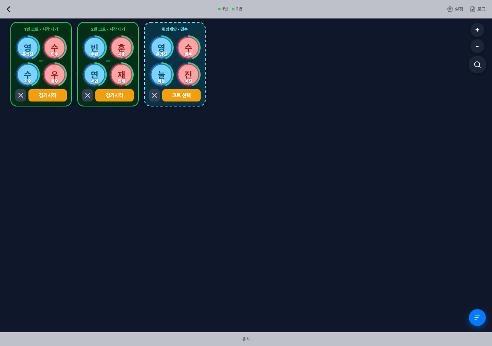

# 기존 보드의 상시 코트 그룹 개선

2026-09-21 · v3 · 현재 UI를 활용한 구현 명세

기존 칠판, 선수 자석, 그룹 카드, 드래그, 추천 모달, 정렬 버튼을 유지한다. 별도 코트 지도 화면을 만들지 않고 **코트 수만큼 항상 존재하는 그룹 안에서 명단과 상태가 바뀌도록** 개선한다.

이 문서가 최신 방향이다. [이전 확대 시안](COURT_BOARD_EXPANDED_DRAFT.md)과 별도 HTML/PDF는 이전 검토 자료이며 이번 구현의 화면 구조가 아니다.

## 기존 화면에 적용한 모습

테스트 데이터로 촬영한 실제 구현 화면이다. 데스크톱에는 코트 그룹과 기존 편성제안 카드가 함께 보이고, 모바일에는 제안을 반영한 코트 그룹이 같은 자리에 남는다.



[모바일 적용 화면 보기](court-board-current-mobile.png)

## 보드에서 바뀌는 점

- 세션의 코트 수가 4개라면 1~4번 코트 그룹이 처음부터 표시된다. 0명이나 1명이어도 사라지지 않는다.
- 좌하단 ‘새 팀 +’는 제거한다. 기존 그룹의 빈 슬롯과 추천 기능으로 편성한다.
- 같은 자리에 44px 원형의 파란색 돋보기 버튼을 둔다. 우상단에는 확대·축소 버튼만 둔다.
- 저장된 사용자 배율이 없는 첫 진입은 코트 4개와 간격이 가로로 들어가는 배율로 시작한다. 실제 보드 너비로 계산하며 범위는 40~100%다. 이미 직접 맞춘 배율이 있으면 우선한다.
- 회원 검색창은 모바일 키보드를 제외한 실제 표시 영역에 맞춘다. 결과 목록 안에서 스크롤하며, 가로 화면처럼 남은 높이가 짧으면 제목·라벨을 접고 입력창과 닫기를 한 줄로 모은다. 입력·결과 한 줄보다도 높이가 부족하면 시트 전체를 스크롤할 수 있다.
- 코트 그룹을 지금처럼 드래그해서 옮긴다. 시작·완료·선수 변경 시 같은 번호와 위치를 유지한다.
- 편집자가 옮긴 코트·선수 좌표는 기존 `sessions.board_drafts.layout`에 명단과 함께 자동 저장한다. 재진입·새로고침·다른 기기에서도 복원하며, 화면 크기에 맞출 때는 배율만 조정한다. 보기 전용 사용자의 개인 이동과 비공개 편성제안의 위치는 공용 배치에 저장하지 않는다.
- ‘정렬’은 가까운 행·열의 기준선만 맞춘다. 상태·인원·번호 순으로 다시 배치하지 않는다.
- 경기 완료에 성공하면 같은 그룹을 다음 팀으로 채운다. 운영진이 ‘경기시작’을 눌러야 다음 경기가 시작된다.

```text
같은 위치의 3번 코트 그룹

┌──────────────────┐     ┌──────────────────┐     ┌──────────────────┐
│ 3번 · 편성 중 2/4 │     │ 3번 · 시작 대기   │     │ 3번 · 경기 중     │
│   민수    빈자리  │ ──→ │   민수    서연   │ ──→ │   민수    서연   │
│   지훈    빈자리  │     │   지훈    유진   │     │   지훈    유진   │
│    [자동매칭]    │     │   [경기시작]     │     │   [경기완료]     │
└──────────────────┘     └──────────────────┘     └──────────────────┘
                               ↑                         │
                               └──── 다음 자동 편성 ─────┘
```

위 그림은 상태 변화를 펼친 것이다. 실제 화면에서는 카드가 이동하거나 여러 개 생기지 않는다.

## 상태

| 표시 | 의미 | 동작 |
| --- | --- | --- |
| 편성 중 · 0~3/4 | 인원이 부족함 | 빈 슬롯에 선수 추가, 자동매칭 |
| 예약 대기 | 4명을 골랐지만 다른 경기의 예약 선수가 합류 전 | 예약 표시 유지, 시작 대기. 예비팀과 같은 이름(2026-09-25, 예전 '합류 대기'). '합류 대기'는 이름 없는 빈자리([합류 대기 자리](TEAM_GENERATION_RULES.md#합류-대기-자리-2026-09-24))만 뜻한다 |
| 시작 대기 | 4명 모두 출전 가능 | 경기시작, 명단 수정 |
| 경기 중 | 해당 번호 코트에서 진행 중 | 경기 수정, 경기완료 |
| 운영진 교대 대기 | 마지막 운영진 출전을 보류하는 기존 규칙 | 교대 확인 |

‘편성제안’은 회원이 제안하고 운영진 승인을 기다리는 별도 카드다. 코트 진행 상태와 분리하므로 모든 코트가 경기 중이어도 제안을 받을 수 있다.

운영진도 보기 모드에서는 남는 대기 자석을 모아 편성제안을 보낼 수 있다. 운영진 본인의 참가 등록은 필요 없다. 본인 제안은 취소할 수 있고, 코트에 반영하거나 경기를 시작하려면 편집 권한이 필요하다. 일반 회원은 세션 참가자만 제안할 수 있다. 이 권한 확장에는 `20260922020000_admin_viewer_match_proposals.sql` 적용이 필요하다.

## 편성제안 덮어쓰기

```text
편성제안 카드                    경기 시작 전 코트 그룹
┌──────────────────┐           ┌──────────────────┐
│ 편성제안 · 민수   │   드래그  │ 3번 · 시작 대기   │
│   A  B / C  D     │ ───────→  │   기존 4명 명단   │
└──────────────────┘           └──────────────────┘
                                        ↓
                              번호·위치는 그대로 유지
                              기존 명단·예약·확정 정보 초기화
                              제안 명단 A / B / C / D 반영
                              [경기시작]은 별도로 누름
```

1. 운영진이 편성제안 카드를 코트 그룹에 겹쳐 놓는다. 반영 가능한 그룹 위에는 ‘놓으면 명단 교체’가 표시된다.
2. **빈 그룹, 일부 편성된 그룹, 네 명이 채워진 그룹 모두 교체 가능하다.** 경기 중인 코트에는 적용하지 않는다.
3. 기존 명단·예약·슬롯·확정 정보를 초기화하고 제안 명단을 넣는다. 기존 선수는 다른 경기나 그룹에 소속되지 않았다면 대기 상태로 돌아간다.
4. 제안의 1~3명 명단도 반영할 수 있다. 이 경우 코트 그룹은 ‘편성 중’이 된다.
5. 성공하면 제안 카드만 사라진다. 코트 그룹의 번호·식별자·위치는 유지한다.
6. 네 명인 제안의 ‘코트 선택’ 버튼에서도 기존 모달 형태로 대상 코트를 고를 수 있다. 교체될 현재 명단을 함께 보여 준다.

별도의 ‘승인됨·배정 대기’ 큐는 만들지 않는다. 운영진이 대상을 지정하는 동작이 승인과 반영이다.

서버에서 편집 권한, 최신 제안·보드 버전, 코트의 경기 진행 여부, 선수의 참가·휴식·콕 확인·타 그룹 소속을 다시 검사한다. 대상 그룹에 이미 있는 제안 선수는 허용한다. 다른 그룹에 묶인 선수는 자동으로 빼앗아 오지 않는다. 실패하면 기존 명단과 제안을 보존한다.

명단 교체와 제안 처리 상태 저장은 하나의 DB 트랜잭션이다. 응답을 받지 못해 같은 요청을 재시도해도 중복 적용하지 않는다.

## 자동 편성

- 기존 [네 명 편성 정책](TEAM_SELECTION_POLICY.md)을 사용한다.
- 세션 진입·코트 추가·출전 가능 선수 변경·편집 권한 획득 때 부족한 코트 그룹을 확인한다.
- 완료 성공 후에는 예약 합류를 먼저 처리하고, 완료한 코트에 다음 팀을 채운다.
- 자동 채움은 경기 중·휴식·콕 미확인·다른 그룹 소속/예약 선수를 제외한다.
- 기존 수동 선택은 유지하며, 네 명을 완성할 수 있을 때 남은 자리를 채운다. 이미 완성된 팀은 다시 뽑지 않는다.
- 인원이 부족하면 빈 슬롯을 유지한다. 수동으로 선수를 빼는 동작 자체로 자동 채움을 다시 실행하지 않는다.
- 수동 예약과 기존 자동매칭 버튼은 기존 예약 기능을 유지한다. 다른 경기 선수가 포함되면 ‘예약 대기’가 된다.
- 완료 실패 시 다음 팀으로 넘어가지 않는다. 완료 처리 중에는 중복 입력을 막는다.

## 배치와 정렬

- 버튼·핀치로 최소 40%까지 축소한다. 320px 모바일 화면에서도 코트 그룹 네 개를 가로로 배치할 공간을 확보한다.
- 최초 배치 뒤에는 경기 상태와 명단 변화로 코트 그룹 좌표를 재배치하지 않는다.
- 명시적으로 정렬할 때 24 보드 좌표 단위 이내의 가까운 행·열만 맞춘다.
- 좌우·상하 순서를 유지하고, 정렬로 새 겹침이 생기면 원래 위치를 유지한다.
- 자유 선수 자석은 그룹을 장애물로 보고 정리한다. 선수 정렬 때문에 코트 그룹을 밀지 않는다.
- 코트 수 증가 시 새 그룹만 추가한다. 감소 시 제거된 그룹의 명단과 예약을 해제한다. 경기 중 코트 감소는 기존 세션 설정의 제한을 따른다.
- 위치는 기존처럼 기기 로컬 보드 좌표다. 장소별 저장·공유 배치 편집과 자동 채움 일시정지 설정은 이번 구현에 추가하지 않았다.

## 검증과 적용

- 빈 그룹 유지, 특정 코트에서 시작, 완료 후 같은 그룹 자동 편성, 완료 실패, 경기 중 선수 드롭 차단, 원격 수신과 정렬의 위치 유지에 회귀 테스트를 추가했다.
- 모바일 390px·데스크톱 1280px에서 기존 보드의 제안 드래그와 경기 순환을 브라우저 테스트로 확인한다.
- 제안 덮어쓰기 RPC는 별도 로컬 PostgreSQL 테스트에서 권한·버전 충돌·경기 중 코트·예약 정리·실패 롤백·재시도를 검증한다.
- 운영 반영에는 [DB 마이그레이션](../supabase/migrations/20260922010000_apply_proposal_to_court_group.sql)을 프런트엔드 배포 전에 적용해야 한다. 로컬 구현·검증에서는 운영 DB를 변경하지 않는다.
