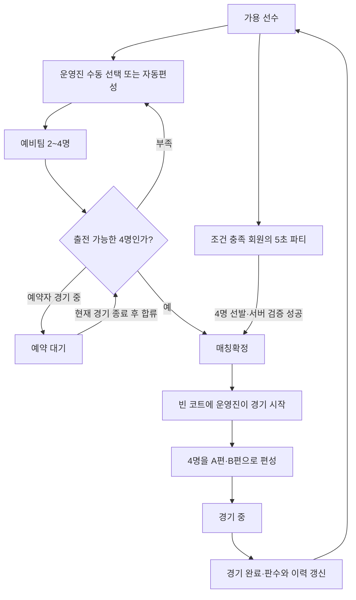

# 팀매칭 기획 정리

> 기준일: 2026-09-07 · 검토 기준: `30ddf07`에서 시작한 로컬 작업 트리의 기획·코드·마이그레이션.
> 이 문서는 **현재 구현된 동작**을 정리한다. 변경 제안은 [모순·정합성 검토](TEAM_MATCHING_REVIEW.md)에 분리했으며, 제안을 확정 정책으로 간주하지 않는다. 운영 DB의 마이그레이션 적용 여부는 확인하지 않았다.

## 1. 목적과 범위

팀매칭은 같은 코트에서 경기할 4명을 모으고, 그 안에서 2명씩 두 편을 나누는 기능이다. 운영진이 보드에서 직접 구성하거나 추천·자동편성으로 빈자리를 채운다. 참가 운영진이 모두 경기 중이면 회원들이 직접 참여하는 ‘회원 파티’로도 4명을 모을 수 있다.

참여 기회를 고르게 배분하고, 같은 조합의 반복과 큰 실력 차이를 줄이는 것이 목표다. **현재 구현은 여러 비용을 합산하는 추천 방식**이다. 적게 뛴 사람의 선발, 혼복의 교대, 재결성 방지, 확정 순서대로 출전을 절대 보장하지는 않는다.

이 문서의 범위는 보드 안의 경기 편성이다. 일정 신청·정원·프리패스, 회비·대관비, 카풀은 별도 기획이다. 경기 득점·승패를 계산하는 기능도 이 범위에 포함하지 않는다. 여기서 ‘점수’는 추천과 페어 균형 계산에 쓰는 내부 비용이다.

### 문서 역할

| 문서 | 용도 |
| --- | --- |
| **이 문서** | 팀매칭 흐름·용어·사용자 규칙을 처음 읽는 기준 문서 |
| [TEAM_GENERATION_RULES](TEAM_GENERATION_RULES.md) | 가중치·공식·함수별 상세와 과거 튜닝 근거 |
| [TEAM_MATCHING_REVIEW](TEAM_MATCHING_REVIEW.md) | 문서 불일치, 구현 문제, 정책 결정 사항과 검증 결과 |
| [session-board](session-board.md) | 드래그·예약·보드 멤버십·편집권·동기화 상세 |
| [planning](planning.md) | 초기 요구의 역사적 기록. 현재 기능의 기준으로 사용하지 않음 |

## 2. 용어와 데이터

| 용어 | 의미 |
| --- | --- |
| 선수 | 해당 회차의 `session_players` 한 행. 경기·추천의 식별자는 `SessionPlayer.id` |
| 회원 | 회차와 독립된 `members` 한 행. 선수의 `memberId`로 연결 |
| 팀 / 그룹 | 같은 경기를 할 **4명 전체**. A/B편과 구분 |
| 페어 / A편·B편 | 같은 편인 2명. `GeneratedTeam.teamA/teamB`에 선수 ID 2개씩 저장 |
| 예비팀 / 드래프트 | 경기 시작 전에 보드에 모아둔 2~4명. 예약 인원도 인원수에 포함 |
| 정식 멤버 / anchor | 예비팀에 직접 소속된 선수. 선수당 최대 한 예비팀 |
| 예약 / ghost | 경기 중인 선수를 예비팀에 미리 표시한 복사본. 현재 경기를 끝내기 전에는 합류 불가 |
| 선택된 멤버 / `confirmed` | 추천 계산에서 이미 고른 사람. 모달에서 고른 임시 선택도 포함하며, **매칭확정 상태와는 다른 개념** |
| 매칭확정 / `confirmedMs` | 바로 출전할 수 있는 4명을 확보한 팀에 확정 시각을 부여한 상태 |
| 보정 판수 / `gameCount` | 추천에 사용하는 판수. 완료 경기마다 +1이고, 늦참·휴식 복귀 보정으로도 증가하므로 실제 출전 횟수와 다를 수 있음 |
| 그룹 이력 / `groupHistory` | 해당 세션의 완료 경기마다 함께 뛴 선수 묶음. 같은 편·상대편을 구분하지 않음 |
| 직전 유형 / `lastGameType` | 선수의 직전 또는 현재 진행 중인 경기 유형. 추천 시 혼성/동성 전환 계산에 사용 |

실력은 `{ grade: 1~10 }`의 단일 등급이며 10이 가장 높다. 과거 O/V/X·상/중/하 데이터는 읽을 때 등급으로 환산한다. 판독할 수 없는 값은 0으로 반환되며, 선발 단계에서는 ‘정보 없음’으로 취급한다. 페어 계산에서는 아직 0점으로 사용되는 차이가 있다([검토 R8](TEAM_MATCHING_REVIEW.md#r8-미등급-선수의-의미가-단계마다-다름)).

`singleWomanIds`는 원본 `Player.id` 목록이다. 경기·예약·그룹 이력에 쓰는 `session_players.id`와 혼동하지 않는다.

## 3. 참여 가능 상태와 권한

### 선수 상태

| 상태 | 보드 표시 | 일반 추천·자동편성 |
| --- | --- | --- |
| `waiting` + 콕 확인 완료, 또는 콕 체크 꺼짐 | 대기 선수 | 다른 팀에 소속되지 않았다면 후보 |
| `waiting` + 콕 체크 켜짐 + 콕 미확인 | 비활성 선수 | 제외 |
| `playing` | 현재 코트의 선수 | 운영진 추천에서 예약 후보로 가능. 빈 슬롯에 여러 명 예약 가능 |
| `resting` | 보드에 남고 휴식 표시 | 제외. 복귀 후 다시 후보 |

일반 보드에서는 코트에 실제 배치된 ID 집합으로 경기 중 여부를 판단한다. 회원 파티는 코트와 선수 `status`를 모두 검사한다. 자석이 없는 선수도 추천 대상에서 제외한다.

휴식 중에는 팀 소속·예약을 해제하고 `wait_since`를 비운다. 휴식 복귀 시 판수를 보정하고 대기시간을 다시 시작한다. **경기 수정 화면은 현재 이 후보 규칙을 공유하지 않는다**([검토 R1](TEAM_MATCHING_REVIEW.md#r1-경기-수정이-일반-편성의-참여-조건을-우회)).

### 역할

| 역할 | 가능한 일 |
| --- | --- |
| 보드 편집권을 가진 운영진 | 팀 구성·추천 선택·자동편성·매칭확정·경기 시작/수정/완료·휴식/콕 확인 |
| 읽기 모드 참가자 | 공유 보드 조회. 회원 파티 조건을 충족하면 본인 참여 가능 |
| 회원 파티 서버 처리 | 유효한 참가자 중 제안된 4명으로 확정 팀 1개 생성. 일반 편집권이나 경기 시작 권한을 주지는 않음 |

보드 편집권은 한 기기가 소유하며 명시적 이양·가져오기로 이동한다. 일반 보드 저장과 경기 시작·수정·완료 RPC는 서버의 편집권 검증을 거친다.

## 4. 전체 흐름



### 4.1 팀 만들기와 채우기

- 새 팀 버튼, 자유 선수 선택, 기존 예비팀의 빈 슬롯에서 추천 모달에 진입한다.
- 직접 고른 선수는 유지한다. 추천 목록은 한 명을 선택할 때마다 해당 구성을 기준으로 다시 계산한다.
- 모달의 **확인**은 선택한 선수를 팀에 넣는 동작이다. 별도 단계인 **매칭확정**을 뜻하지 않는다.
- **자동편성**은 추천 모달 하단의 버튼이다. 남은 자리를 한 명씩 선발하고, 매번 점수를 다시 계산한다.
- 후보가 부족하면 가능한 만큼만 채운다. 2명 미만의 예비팀은 남기지 않는다. 전체 팀 조합을 탐색해 최적해를 찾는 방식은 아니다.

### 4.2 추천 방식별 후보 차이

공통으로 현재 선택된 멤버, 휴식·콕 미확인 선수, 자석 없는 선수, 다른 예비팀의 정식 멤버를 후보에서 제외한다.

| 항목 | 운영진 직접 선택용 추천 | 운영진 자동편성 | 회원 파티 |
| --- | --- | --- | --- |
| 현재 경기 중인 선수 | 예약 후보로 포함 | 예약 후보로 포함 | 제외 |
| 다른 팀에 이미 예약된 선수 | 포함 가능 | 제외 | 제외 |
| 경기 중인 선수 수 제한 | 여러 명 예약 가능. 팀 정원 4명·대기 정식 멤버 최소 1명 | 동일. 빈 슬롯에 여러 명 자동 예약 가능 | 0명 |
| 홀드 버튼 참여 필요 | 없음 | 없음 | 현재 유효하게 누르고 있는 사람만 |
| 게스트 | 세션 선수로 등록되어 있으면 가능 | 동일 | 로그인 회원 연결·본인 확인 필요 |
| 후보 부족 | 선택 가능한 만큼 | 가능한 만큼 채움 | 4명 미만이면 취소 |
| 결과 | 예비팀 | 예비팀 | 서버 검증 후 매칭확정 팀 |

자동편성의 팀당 예약 1명 제한은 제거했다. `대기 2명 + 예약 2명`, `대기 1명 + 예약 3명`을 허용한다. 이미 예약한 사람이 있어도 빈 슬롯에 추가 예약할 수 있다. 새 팀에 대기 정식 멤버가 아직 없다면 자동편성이 마지막 한 자리를 남겨 확보한다. 경기 중인 4명만으로 만드는 예약 전용 팀은 현재 보드 구조에서 지원하지 않는다.

### 4.3 예약과 합류

경기 중인 선수를 고르면 예비팀의 예약으로 표시한다. 예약자가 현재 경기를 끝내거나 경기 수정으로 빠지면 예약된 예비팀의 정식 멤버로 승격한다. 여러 팀에 수동 예약되어 있다면 가장 오래된 예약을 우선하고 나머지를 정리한다.

정식 멤버가 된 선수는 어느 팀에서도 예약으로 남지 않는다. 예약자들은 각자의 경기가 끝나는 순서대로 합류한다. 예약자를 포함해 4명이어도 누군가 경기 중이면 ‘예약 대기’이고 매칭확정을 할 수 없다. 서로 다른 코트에서 예약했다면 마지막 예약자의 경기 종료까지 기다린다.

### 4.4 매칭확정과 경기 시작

매칭확정은 유효한 4명 전원이 경기 중이 아니고, 예약 멤버가 다른 예비팀의 정식 멤버로 묶여 있지 않을 때 가능하다. 빈 코트는 없어도 된다.

확정 시각 순으로 순번을 표시하고, 동률이면 팀 ID 순으로 정한다. 빈 코트가 생기면 시작 가능한 가장 앞 팀의 버튼을 강조한다. **순번은 안내이며 다른 확정 팀도 시작할 수 있다.** 자동으로 코트에 들어가지는 않는다.

운영진이 경기 시작을 누르면 첫 빈 코트를 찾고 `pairPlayers`로 페어를 계산한 뒤 서버에 배정한다. 배정 성공 후 예비팀을 해체한다. 인원 감소로 4명 미만이 되면 확정을 해제하고, 4명을 유지하는 팀 멤버 교체·스왑은 순번을 유지한다.

예비팀의 슬롯 위치는 최종 A/B편 고정 약속이 아니다. 회원 파티가 생성 시 계산한 페어도 경기 시작 시 다시 계산되므로, 동점이면 바뀔 수 있다.

## 5. 4명 선발 규칙

정확한 수치와 수식은 [알고리즘 규칙 §2·§7](TEAM_GENERATION_RULES.md#2-후보-점수--rankcandidates)을 기준으로 한다. 모든 항목을 더한 **총비용이 낮을수록 추천 순위가 높다**.

| 판단 항목 | 현재 의미 |
| --- | --- |
| 보정 판수 | 적을수록 우대. 다른 비용 차이가 크면 더 많이 뛴 선수가 앞설 수 있음 |
| 그룹 재결성 | 후보가 포함된 과거 완료 경기와 새 구성의 겹침을 계산. 2명·3명·4명 겹침 순으로 비용이 커지고, 해당 경기 건수만큼 누적 |
| 새 만남 | 아직 못 만난 선택 멤버 한 명당 -12점. 첫 선발은 현재 후보들 중 미만남 비율로 만남 폭이 좁은 사람을 우대 |
| 실력 | 선택된 멤버의 최저~최고 등급 범위를 넓히는 폭의 제곱에 비용 부과. 범위 안 후보끼리는 이 항목에서 동점 |
| 대기시간 | 마지막 대기 시작 이후의 분 수만큼 비용을 낮춤. 경기 중인 선수는 0분 취급. 상한 없음 |
| 유형 로테이션 | 직전 경기와 다음 목표가 혼성/동성 중 같은 성격이면 비용, 다른 성격이면 보너스. 선택된 멤버와 후보 본인의 계산 강도가 다름 |
| 성별 구성 | 남녀가 섞인 구성에서 2남2녀 완성을 우대하고, 한 성별이 3명 이상이면 비용. 해당 단독 여성이 허용된 3남1녀는 예외 |
| 경기 중 여부 | 예약 후보마다 비용을 추가. 자동편성도 여러 명 예약 가능 |

추가 해석은 다음과 같다.

- **첫 선수도 추천으로 선발**한다. 판수·혼복수·대기·현재 후보 풀의 미만남 비율을 비교하고, `recommendTeammates`는 유형 로테이션·경기 중 비용도 더한다.
- 그룹 이력은 세션 안의 완료 경기만 쓴다. 진행 중인 경기·예비팀은 재결성 이력에 아직 없고, 최근 경기라고 더 크게 가중하지도 않는다.
- 새 만남 판단에는 진행 중인 경기의 동반 여부도 포함한다. 이미 같은 코트에 있는 사람을 ‘아직 안 만난 상대’로 보상하지 않는다. 새 만남은 당일 기준이며 지난 모임의 이력은 포함하지 않는다.
- 같은 편을 반복하는지, 상대편을 반복하는지를 별도로 세지 않는다. 페어 단계에도 파트너 이력 항목은 없다.
- 로테이션은 ‘남복·여복’과 ‘혼복·혼합’의 두 범주를 비교한다. 개인별 혼복 할당량이나 일정한 교대 주기를 보장하지 않는다. 누적 혼복수 가중치는 현재 0이다.
- 추천 비용이 같으면 후보 입력 순서를 유지한다. **4명 선발은 무작위 추첨이 아니다.** 시간 의존 항목이 있어 동일한 선수 데이터라도 계산 시각에 따라 비용은 달라질 수 있다.

새 만남 보정의 목적·전후 지표는 [팀 섞임 검증](TEAM_MIXING_VALIDATION.md)에 정리했다. 더 다양한 상대와 만나도록 유도하지만 실력 범위·대기시간과의 절충이 있으며, 전체 일정에서 모든 쌍의 만남을 보장하는 방식은 아니다.

### 추천 화면의 별도 예외

직접 선택용 추천 모달에서는 기본 비용을 후보 집합의 상대 적합도 0~100%로 환산한다. 대기 후보 중 10% 이상인 사람이 하나도 없으면 경기 중 비용을 0으로 두고 다시 추천한다. 자동편성과 회원 파티에는 이 모달 전용 재계산이 없다.

따라서 추천 화면의 순위와 자동편성의 선택을 완전히 같은 것으로 설명하면 안 된다. 적합도 %도 성공 확률이나 절대적인 팀 품질이 아니라 **현재 후보들 사이의 상대값**이다([검토 R7](TEAM_MATCHING_REVIEW.md#r7-추천-화면과-자동편성의-점수-정책이-다름)).

## 6. 판수 보정과 경기 이력

### 늦참·휴식 복귀

```text
기준 평균 = 반올림(같은 세션의 기존 대기/경기 중 참가자들의 game_count 평균)
            본인·휴식 제외, 콕 체크 ON이면 미확인 제외
            대상이 없으면 0
보정 판수 = max(기존 game_count, 기준 평균)
대기 시작 = 현재 시각
```

사용자의 ‘늦참 시점 평균 판수 반영’ 제안에 맞춰, 현재 코트에 있는 사람뿐 아니라 이미 참가해 대기 중인 사람도 평균에 포함하는 기본안으로 구현했다. 판수는 **완료된 경기 + 이전 보정값**이며 진행 중인 한 판을 미리 더하지 않는다. 예를 들어 기존 참가자가 `2, 3, 3, 4`판이면 늦참자는 추천용 판수 `3`으로 시작하고 그때부터 대기시간을 쌓는다.

| 상황 | 보정 시점 |
| --- | --- |
| 콕 체크 ON | 명단 등록 후 최초 콕 확인 시점. 확인된 상태로 추가하면 추가 시점 |
| 콕 체크 OFF | 참가자 명단에 새로 추가하는 시점 |
| ON → OFF 변경 | 미확인 대기자가 참가 가능해지는 시점. 전환 전 확인된 참가자의 평균 적용 |
| 휴식 복귀 | 대기로 복귀하는 시점 |

이미 콕 확인된 선수의 재확인, 기존 행의 이름·설정 수정, OFF 설정의 재저장은 판수·대기시간을 다시 보정하지 않는다. 기존 판수를 낮추지는 않으며 평균 계산은 소수점을 **반올림**한다. 예비팀 소속 선수도 평균에는 포함되므로 특정 편성의 추천 후보 평균과는 다르다.

[2026-09-07 보완 SQL](../supabase/migrations/20260907040000_late_join_game_count.sql)과 로컬 검증까지 완료했다. **운영 DB 적용은 아직 하지 않았다.** 이전 구현의 누락과 검증 결과는 [검토 R5](TEAM_MATCHING_REVIEW.md#r5-합류-보정의-활성-평균과-적용-시점이-불완전)에 기록했다.

수학적으로 신규 참가자의 평균 오차는 최대 0.5판이며, 다른 상태 변화 없이 여러 명이 합류해도 반올림 기준은 유지된다. 다만 경기 완료 직전/직후 합류는 최대 1판 차이가 나고, 이력이 없는 늦참자가 그룹 반복 벌점 때문에 기존 참가자보다 먼저 추천될 수 있다. 평균 보정이 공정한 출전 순서를 보장한다는 뜻은 아니다([증명·수치 반례·실행 검사](TEAM_MATCHING_MATH.md)).

### 경기 완료

서버에서 경기 상태를 `completed`로 바꾸고 최종 참가자의 스냅샷을 기록한다. 최종 참가자는 `waiting`으로 돌아가고 `game_count`가 1 증가하며 `wait_since`가 완료 시각으로 갱신된다. `mixed_count`는 현재 **경기 유형이 혼복일 때 남성 선수만** 증가한다. 혼합은 포함하지 않는다.

완료 경기의 선수 묶음은 그룹 이력에 추가한다. 동일한 `matchId`를 중복 반영하지 않으며, 새 세션은 빈 이력에서 시작한다. 선수 삭제로 FK가 비면 이력에 남은 ID 수가 4명 미만일 수 있다.

초기 로드는 완료·진행 중 경기로 직전 유형을 구성한다. 일반 경기 시작·완료 이벤트도 이를 갱신한다. 그룹 이력은 재동기화 때 복구되지만 **직전 유형은 현재 재동기화 경로에서 복구되지 않는 누락**이 있다([검토 R3](TEAM_MATCHING_REVIEW.md#r3-재연결-복구에서-직전-경기-유형이-누락)).

## 7. 게임 유형과 2v2 편성

### 현재 게임 유형 분류

| 4명의 구성 | 현재 저장하는 유형 |
| --- | --- |
| 남4 | 남복 |
| 남2·여2 | 혼복 |
| 여4 | 여복 |
| 남3·여1, 단독 여성이 `allowMixedSingle` 또는 `singleWomanIds`로 허용됨 | 혼합 |
| 남3·여1, 단독 여성이 허용되지 않음 | **남복** |
| 남1·여3 | **남복** |

마지막 두 행은 코드에 존재하는 분류다. 추천의 성별 비용은 편성을 막는 검증이 아니며, ‘남복 편성 허용 여성’ 설정도 미허용 조합을 금지하지 않는다. 분류명과 실제 성별 구성이 어긋나는 점은 정책 결정 사항으로 남긴다([검토 R6](TEAM_MATCHING_REVIEW.md#r6-허용-설정과-실제-성별-분류의-의미가-어긋남)).

### 페어 결정

혼복은 남녀 한 명씩 구성되는 2가지 페어 조합을 비교한다. 그 외 유형은 3가지 조합을 비교한다.

```text
페어 비용 = 0.5 × (A편 내부 등급 차이 + B편 내부 등급 차이)
          + 1.5 × |A편 등급 합 - B편 등급 합|
```

최소 비용 조합을 고르고, 최소값이 여러 개면 그중 무작위로 선택한다. 이 단계에서는 구성원 4명을 바꾸지 않는다. 실력 범위가 이미 넓은 4명이라면 두 편의 합을 맞추더라도 모든 선수의 실력이 비슷한 경기로 만들 수는 없다.

## 8. 회원 파티

1. 세션이 진행 중이고, 해당 세션에 참가한 유효한 운영진이 한 명 이상이며 모두 실제 경기 중이면 기능이 나타난다.
2. 읽기 모드의 가용한 로그인 회원이 버튼을 누르면 공유 5초 모집이 시작된다. 누르고 있는 동안만 참가한다.
3. 마감 후에도 유효하게 누르고 있는 후보 중 4명을 기존 자동편성 점수로 선발한다. 처음 누른 회원·확정 요청자를 반드시 선발하지 않는다.
4. 4명 미만이면 취소한다. 누르지 않은 대기자나 경기 중인 선수로 보충하지 않는다.
5. 서버가 로그인 본인·홀드 유효성·선수 상태·운영진 상태·보드 버전을 확인하고 확정 팀 1개를 원자적으로 추가한다. 점수 최적성 자체는 서버에서 재계산하지 않는다.
6. 일반 확정 팀과 같은 순번 안내에 합류한다. 경기 시작은 운영진이 수행한다.

누름은 약 1초마다 갱신하는 3초 유효기간으로 확인한다. 손을 떼거나 화면을 벗어나면 해제하고, 통신이 끊기면 만료된다. 서버는 마감 후 새 참가를 막고 기존 유효 참가자의 갱신만 허용한다. 확정 지연이 길어지면 마감 10초 후 취소되므로, 정확히 마감 순간에 참가자 명단을 영구 고정하는 방식은 아니다.

구현: [memberParty.ts](../src/lib/board/memberParty.ts), [useMemberParty.ts](../src/hooks/useMemberParty.ts), [회원 파티 RPC](../supabase/migrations/20260907010000_member_party.sql), [Realtime 후속 변경](../supabase/migrations/20260907020000_member_party_realtime.sql).

## 9. 유지할 구분과 후속 결정

다음 사항은 현재 서로 다른 개념이므로 합쳐 설명하지 않는다.

- **4명 선발과 페어 분할**: 전자는 참여·조합 다양성, 후자는 해당 4명 안의 균형을 다룬다.
- **보정 판수와 실제 출전 기록**: 경기 통계는 완료 경기 기록을 기준으로 해석해야 한다.
- **후보 제외 조건과 비용**: 휴식·콕 확인 같은 후보 자격과, 경기수·실력·성별 선호는 다른 종류의 규칙이다.
- **확정 순번과 출전 강제 순서**: 현재 순번은 안내다.
- **제거된 과거 후보 생성·대기열과 현재 보드 기능**: 다전략 후보 일괄 생성·`match_queue`는 제거됐지만, 보드 자동 채움·ghost 예약·확정 순번·회원 파티는 존재한다.

다음 기획 개편에서 먼저 결정할 항목은 성별 조합의 허용 범위, 경기 수정에 적용할 참가 자격, 보정 평균의 대상, 판수·대기·재결성 사이의 우선순위다. 구체적인 재현 조건과 제안은 [정합성 검토](TEAM_MATCHING_REVIEW.md)에 정리했다.
